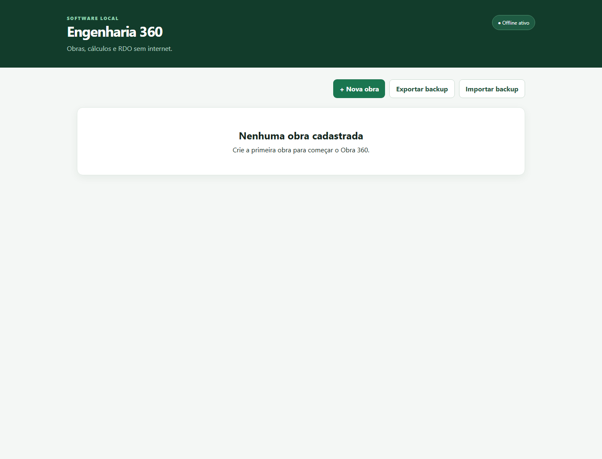

# Relatório de usabilidade — Engenharia360

Data: 15/08/2026  
Escopo: tela inicial e inspeção dos fluxos de obra, RDO, calculadoras e BIM.

## Evidência capturada

## Veredito

A tela inicial é simples e orienta bem o primeiro passo, mas o produto ainda precisa de uma camada de navegação e confirmação de estado para uso diário por engenheiros. O maior risco atual é o usuário não saber onde estão cálculos, RDO, documentos e BIM depois de abrir uma obra.

## Etapas auditadas

1. **Abertura sem obras — saudável após correção.** A tela informa que não há obras e oferece “Nova obra” como ação principal. Foi encontrado e corrigido um erro que quebrava a tela inicial ao tentar acessar o painel BIM sem obra selecionada.
2. **Cadastro e seleção de obra — parcialmente saudável.** O fluxo é direto, mas precisa orientar campos obrigatórios, formato do código e próximos passos após salvar.
3. **Obra 360 — parcialmente saudável.** Reúne etapas, pendências, RDO, cálculos, materiais e documentos, porém a quantidade de blocos pode sobrecarregar e não há navegação por abas ou resumo de prioridades.
4. **RDO — parcialmente saudável.** O formulário cobre muitos campos, mas é extenso. Deve usar etapas, valores padrão e salvamento como rascunho.
5. **Calculadoras — parcialmente saudável.** A seleção é ampla, mas o usuário precisa entender a finalidade, entradas obrigatórias, unidades, versão normativa e limites do resultado antes de executar.
6. **BIM — parcialmente saudável.** O fluxo já prevê importação, análise, conflitos, pendências e viewer, mas precisa de estados de processamento, erros técnicos traduzidos e uma lista de conflitos mais operacional.

## Achados prioritários

### P0 — bloqueio de primeiro uso

- A inicialização já apresentou tela branca por acesso a `bimModelos` quando não havia obra. Corrigido nesta auditoria; manter teste de regressão.

### P1 — clareza operacional

- Criar navegação interna: **Visão geral, RDO, Cálculos, BIM, Materiais e Documentos**.
- Mostrar sempre “obra atual”, data da última atualização e status de sincronização local.
- Transformar mensagens técnicas do Python/SQLite em mensagens com causa e ação recomendada.
- Antes de executar cálculo ou BIM, mostrar unidade, versão normativa e aviso de pré-dimensionamento.

### P1 — redução de carga cognitiva

- Dividir RDO completo em seções recolhíveis.
- Separar “ações frequentes” de “ações administrativas”.
- Destacar pendências abertas e conflitos BIM de alta gravidade no topo.
- Usar filtros persistentes e contadores visíveis.

### P1 — acessibilidade

- Garantir foco visível e foco inicial dentro dos modais.
- Adicionar `aria-label` aos botões de ícone e controles BIM.
- Não depender apenas de cor para status; usar texto e ícone.
- Aumentar áreas clicáveis dos controles pequenos em telas de campo.
- Conferir contraste e navegação completa por teclado.

### P2 — confiança e recuperação

- Confirmar operações destrutivas e explicar o que será removido.
- Exibir progresso e cancelamento em análises longas.
- Permitir reabrir o último cálculo/RDO após falha.
- Mostrar tamanho do backup e data do último backup.

## Limitações da auditoria

A captura visual foi feita na tela inicial. Os fluxos internos foram avaliados por código e estrutura da interface, mas não foi possível capturar nesta execução uma obra preenchida, um RDO aberto ou um viewer BIM com IFC real. Portanto, a acessibilidade dinâmica, o comportamento de foco e a experiência de modelos grandes ainda precisam de teste manual com dados reais.
